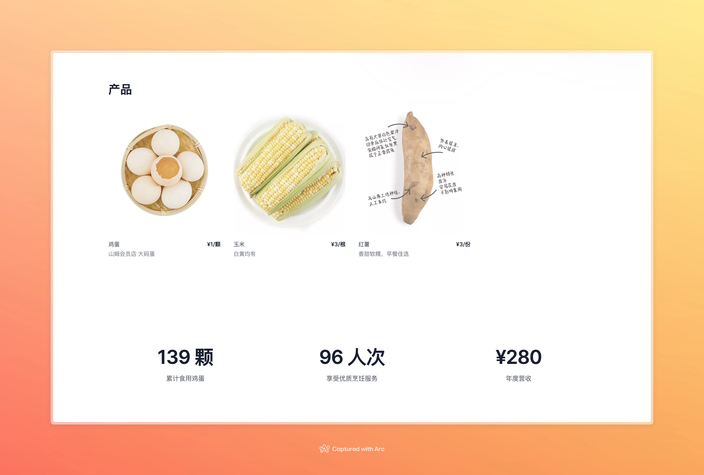
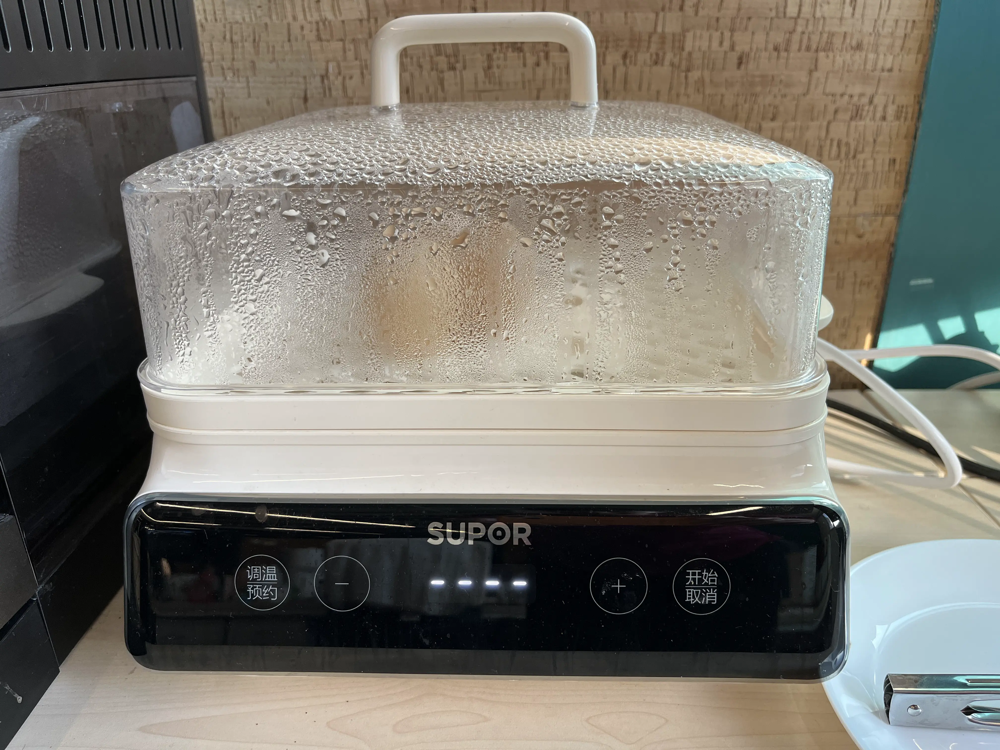
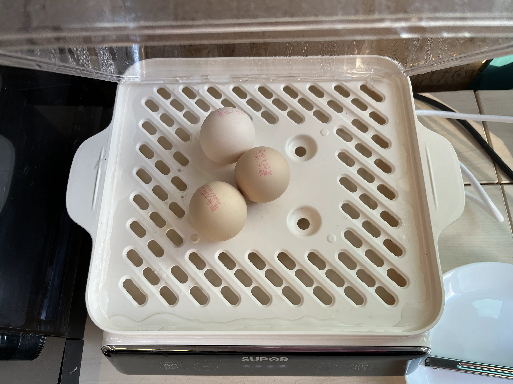
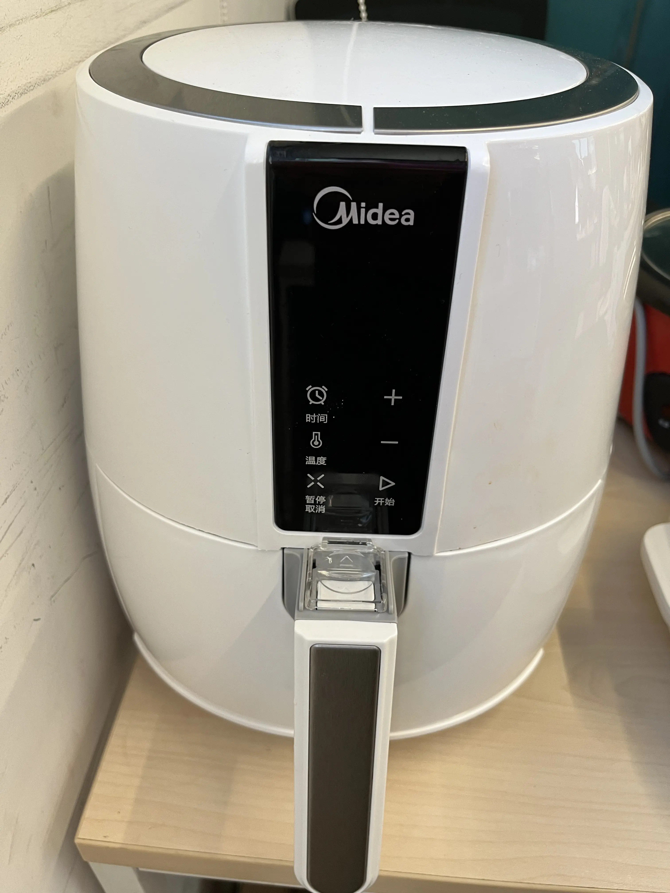
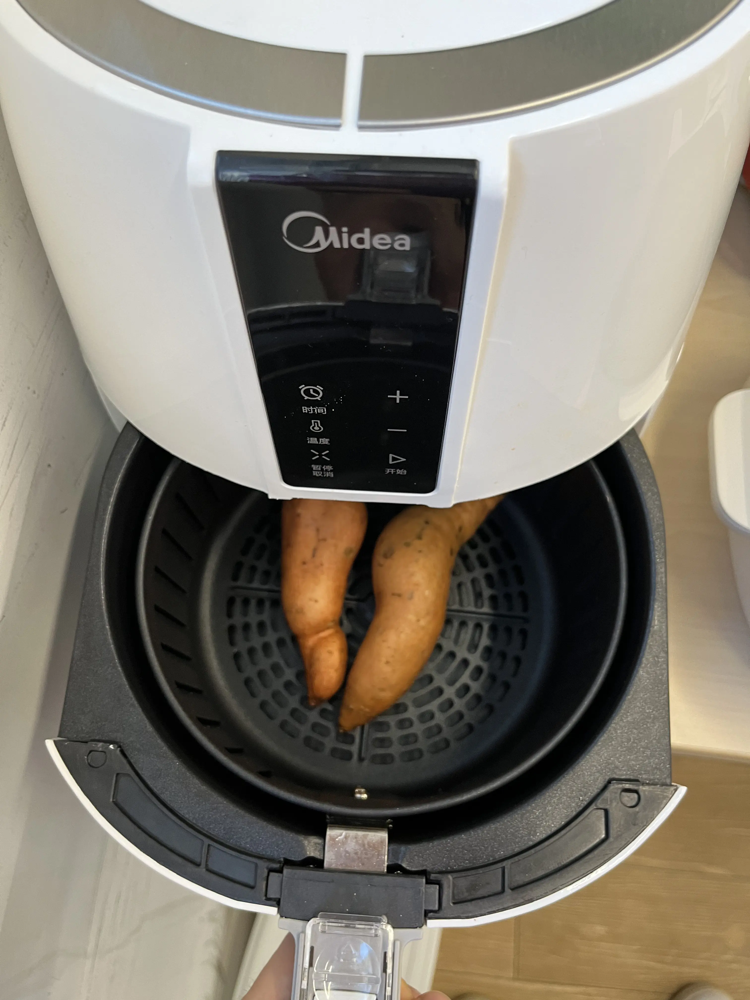
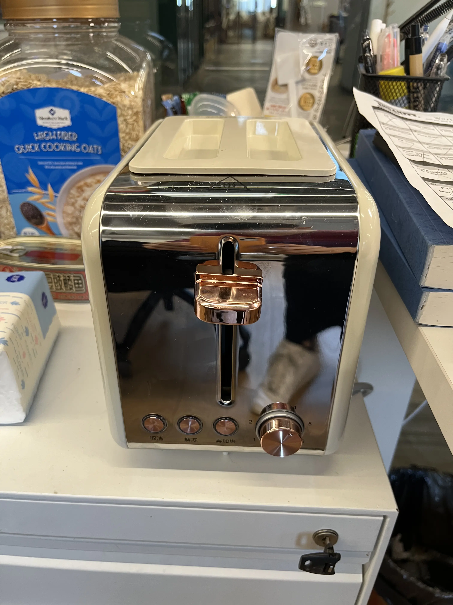
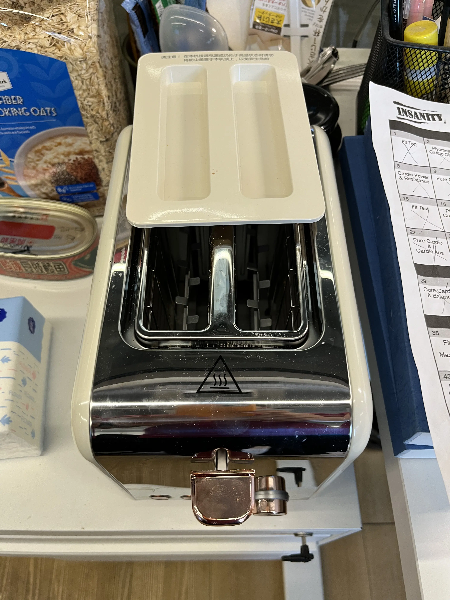

# 早餐记录

- 多端实时记录早餐
- 展示今日早餐所需烹饪食材数量
- 展示历史烹饪记录

## 界面预览



## 开发

### 安装依赖
```shell
$ bundle install
```

### 初始化数据库
```shell
$ rails db:migrate
```

### 启动服务
```shell
$ rails server
```

## 部署
```yaml
# docker-compose.yml
version: '3'

services:
  breakfast_tracker:
    image: ghcr.io/muxinqi/breakfast-tracker:1
    container_name: breakfast_tracker
    restart: always
    ports:
      - "3000:3000"
    environment:
      - RAILS_MASTER_KEY=<PLEASE_REPLACE_ME>
    volumes:
      - breakfast_tracker-storage:/rails/storage

volumes:
  breakfast_tracker-storage:
```

### 启动服务
```shell
$ docker compose up -d
```

### 访问服务
```shell
$ curl http://localhost:3000
```

## 项目源起

2023年秋，[胖哥](https://littlefat.cn)在办公室置办了蒸锅，并且在山姆超市接连购买了🥚鸡蛋、🌽玉米和🍠红薯。办公室的小伙伴们觉得很不错，于是胖哥决定每天早上都给大家做早餐。

|  |  |
|------------------------------------------|-------------------------------------------|


由于大家的早餐需求可以每天都有可能发生变化，这样就需要在每一天的晚上来确认第二天的早餐需求。

为了简化这个过程，我打算开发个小工具来记录每天的早餐需求，大家可以方便地修改，对于烹饪前的需求确认，也是一目了然。


## 未来发展

随着胖哥在办公室置办的厨房电器越来越多，加上毛线球迎来远程办公的政策。

| 空气炸锅 |  |  |
|------|----------------------------------|-----------------------------------|
| 烤吐司机 |    |    |

大家的早餐更加多样化，需求也更加灵活，这个小工具也进入了养老阶段。


## 开发感悟

开发之初是想要通过一个简单好看的工具，来简化早餐中麻烦的步骤。由于之前一直想要上手 Rails，读官方手册、看第三方教程，都感觉没能成功入门。

纸上得来终觉浅，于是就有了这个项目。

在开发过程中，从 Rails 中学到了不少最佳实践，这一点我很满意，因为相较于其他一些小框架来说，很多东西都需要自己配置，如果没有最佳实践的指引的话，新手很可能会搞出来自己的一套舒适区，未来如果要协作的话，大家都很头疼。

习惯了命令行创建项目、创建 controller 创建 model 之后，莫名其妙的感觉效率很高的样子。

不得不说的是，IDEA + Ruby 插件在开发期间发挥了很大作用，在之前两次尝试入门的时候，当前的 Ruby 插件貌似还不够完善，很多能自动补全/智能感知的地方都没有生效，导致开发体验很差。

今年就完全不同了，几乎在能想到的任何地方，都能感受到 IDEA 之于 Java 的那种舒适感。

如果给未来的自己留一句话，那就是：下次记得要学会写测试！
